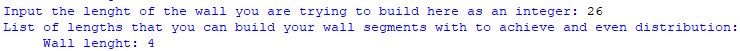

# The objective of this programm

This programm is designed to help you with designing walls or any other lenght of material and dividing it into segments using pillars or other seperators.
This programm was originally conceived from the necessity to divide a wall I was building in the videogame Minecraft into equally wide wall segments using pillars.
I could not find any programm online that already did this. As the wall segment was quite long and the only way to figure out if a given lenght for each wall segment would yield even distribution would be quite tidious.
You would have to manually build each segment and look if it distributed evenly on the lenght of the wall or if it went over the lenght of the wall or under it.
This programm is designed specifically for this use case and is therefor optimized to be used in minecraft. This is the case because the programm asks you to input an integer for the lenght of your wall.
In Minecraft the standard unit of measurement is meters or "blocks" as each block in the game is one meter in lenght. This means that the pillars that you use to seperate the segments will also be one meter wide.
In real life pillars rarely take up exactly a meter of space so this programms functionality is not exactly gurranteed for real life usage and may need to be improved on for this to be achieved.
Using the programm in Minecraft however works perfectly as you never have to deal with decimals in your measurements and therefore can use integers define the lenght of your wall and pillars.
The programm assumes that the widht of the pillars is one meter ("or one block"). The programm may not function correctly if used to walls with bigger pillar width.

# Why you should use this programm

This programm (as far as I know) is the only one of its kind. The use case is incredibly specific and niche but a very real one.
If you want to achieve what this programm achieves you either have to use this programm or calculate the lenght of your walls manually, which is quite tiresome.

# Installation tutorial

How to install this programm?

To start with you want to make sure you have the latest version of python installed on your computer. We need this to have the programm work correctly.
You can download the most recent version of python by going clicking this link and following the instructions: https://www.python.org/downloads/.

After successfully installing python on your computer you want to navigate to https://github.com/santtunurmi/Minecraft-Wall-Calculator and downloading the directory.
To download the directory, click the box with an arrow in it to the left of the box that says "Clone" and in the "download this directory" -section click on zip.
This will download the programm and all of the required files including this README onto your computer. Once the download has finished you want to extract the zip folder using a programm such as 7zip.
Congratulations! You have now installed the programm and all the nececessary files, which are located in this newly extracted folder. You can move it where-ever you want.

# How to launch the programm

After you have successfully extracted the folder you can open the folders until you see the file "wallCalculator.py". Right click it and click on "open with" and click on "Python".
Congratulations! You now have launched the programm!

# How to use this programm

Here we can see the programm in action. It asks you to "Input the lenght of the wall you are trying to build, here as an integer".
Simply input the lenght of the wall as a whole number (eg. 26) and hit enter. The programm will calculate all possible lenghts for the wall segments that would yield an even distribution.
If there is no possible solution for the lenght of the individual wall segments the programm will inform you of this and asks you to pick a different lenght for the wall a wall to be calculated.

# How to interpret the solution

When a possible solution is found the programm will display it as: "Wall lenght: (number)". This means that, for example, with the lenght of original wall being 26, the programm will list "wall lenght: 4".
This means that if you have a wall that is 26 meters long. You can build wall segments that are 4 meters long and seperate them with a pillar that is 1 meter wide to achieve a totally even distribution on the wall.
Something that should be said about how the programm calculates this is that it assumes that the wall starts and ends with a pillar aswell.
If this is not what you are looking for you can simply add 2 to you original wall lenght that should be calculated and then build the wall without the starting and ending pillars.
This would yield the original desired wall lenght and an even distribution.